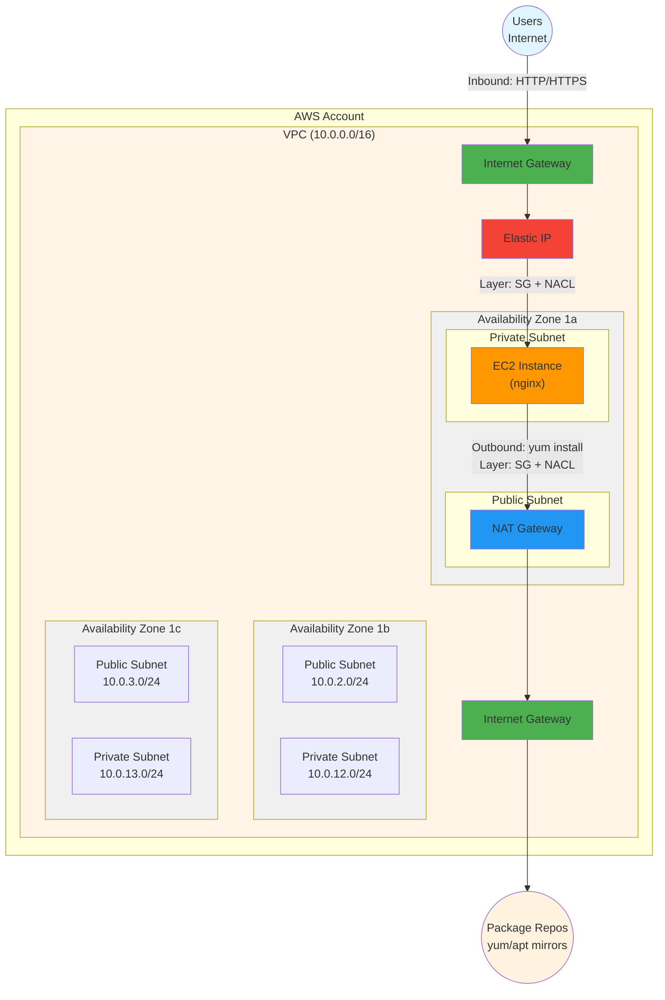

# Part 1

## 1. Workshop Goals
- host a public web application on AWS
- will learn
  - basic terraform/IAC
  - AWS networking fundamentals (VPC, subnets, routing, security)
  - cloud engineering best practices
- hands-on
  - individual AWS account
  - provision real resources
  - troubleshoot real problems

## 2. Architecture for Part 1


## 3. Tools we will need
- [ ] Terraform (`terraform version`)
- [ ] AWS CLI (`aws --version`)

## 4. Intro to terraform
### Infrastructure as Code (IaC)?
- Declarative: Define **what** you want, not **how** to create it
- Version controlled: Git history = infrastructure audit trail
- Repeatable: Same code → same infrastructure every time
- Reviewable: PRs for infrastructure changes
### Why Terraform over ClickOps?
- Drift detection (manual changes show up in `plan`)
- Collaboration (team works on same codebase)
- Documentation (code IS the docs)
### Terraform Basics
#### Key concepts
- **Provider**: an executable that talks to APIs (AWS, GCP, local filesystem)
- **Resource**: Things you want to create (EC2, S3, file)
- **State**: Terraform's memory of what it created (`terraform.tfstate`)
#### Core workflow
- using the sample `local.tf`, lets inspect
```bash
terraform init    # Download providers
terraform plan    # Preview changes (dry-run)
terraform apply   # Execute changes
terraform destroy # Clean up
```
```
├── .terraform
│   └── providers                           # directory to store provider things 
│       └── registry.terraform.io
│           └── hashicorp
│               └── local
│                   └── 2.7.0
│                       └── darwin_arm64
│                           ├── LICENSE.txt
│                           └── terraform-provider-local_v2.7.0_x5 # provider executable
├── .terraform.lock.hcl   # provider versions dependency lock file (2.7.0 in this case)
├── example.txt           # the resource u created
├── terraform.tfstate     # the state
└── local.tf
```
- for collaboration purposes
  - we should store the `terraform.tfstate` in a remote backend (S3)
  - use some form of lock to prevent concurrent access to the state (dynamoDB)


## 5. Authenticate to aws (TODO)
- TODO this one may change depending on how the sandbox account is provisioned
- Log into AWS Console → IAM → Users → [Your User] → Security Credentials
  - Create Access Key → Command Line Interface (CLI)
  - Save the Access Key ID and Secret Access Key
```bash
aws configure
# access key id
# secret access key, etc
```
- `./aws/config`
```
[default]
region = ap-southeast-1
output = json
```
- `./aws/credentials`
```
[default]
aws_access_key_id = xxxx
aws_secret_access_key = xxxx
```
```bash
aws sts get-caller-identity # Should show the account
```

## 6. Setting up remote backend
- Bootstrap a S3 bucket and DynamoDB table on AWS Console (1 time manual thing)
- S3 bucket
  - Bucket name: `workshop-tfstate-<account-id>`
  - ACLs disabled
  - Block all public access
  - Enable bucket versioning
  - Encryption: SSE-S3, enable bucket key
  - Tags 
    - manuallyCreated: true
- DynamoDB table 
  - Table name: `terraform-lock`
  - Partition key: `LockID` (case-sensitive!) (key type: `String`)
  - Sort Key - not required
  - Select `Customize settings`
  - DynamoDB Standard
  - On-demand
  - Keep default values
  - AWS owned key
  - Tags 
    - manuallyCreated: true
- add these to your `local.tf`
```hcl
terraform {
    required_version = ">= 1.0"

    # local provider
    required_providers {
        local = {
            source  = "hashicorp/local"
            version = "~> 2.4"
        }
    }

    # add backend
    backend "s3" {
        bucket         = "workshop-tfstate-<account-id>"
        key            = "terraform.tfstate"
        region         = "ap-southeast-1"
        dynamodb_table = "terraform-lock"
        encrypt        = true
    }
}
```

```bash
terraform init -migrate-state # migrate the local terraform.tfstate to remove backend
aws s3 ls s3://workshop-tfstate # check contents on s3 bucket
terraform destroy # cleanup
```

### Closing up introduction
- create a `main.tf`, with only the terraform block from your `local.tf`
- remove the local provider
- delete `local.tf` we dont need it anymore
