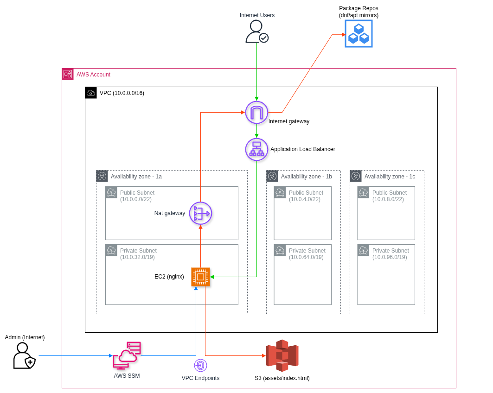

# Part 1 Recap

Use this recap to make sure you can explain the Part 1 architecture and traffic flow clearly before moving into Part 2.

---


## 1) What we built (architecture overview)

In Part 1, you built a small app on AWS with these building blocks:

- VPC (private network boundary)
- Public and private subnets
- Internet Gateway (IGW)
- NAT Gateway
- Route tables
- NACLs and Security Groups
- ALB in a public subnet
- EC2 app server in a private subnet
- IAM role + instance profile for EC2
- VPC endpoints for private AWS service access

You also practiced the supporting workflow around those blocks:

- Terraform and AWS CLI setup
- AWS SSO login flow for CLI access

### Part 1 architecture diagram



---

## 2) Office building analogy

Use this analogy as you study the networking flow:

- VPC = office compound
- Subnet = floor in the building
- Public subnet = reception floor
- Private subnet = staff-only floor
- IGW = front gate
- NAT Gateway = outbound mailroom
- Route table = directional signs inside the building
- NACL = floor security desk (checks every packet, remembers nothing)
- Security Group = badge scanner at a specific room (stateful)
- ALB = receptionist that routes visitors to the right staff member

---

## 3) Networking fundamentals (VPC, subnet, route table, IGW, NAT, VPC endpoints)

### VPC and subnets

- VPC is your isolated IP network in AWS.
- A subnet is a slice of that VPC CIDR range.
- Public subnet has a route to IGW.
- Private subnet has no direct route to IGW.
- Subnets are AZ-specific, so spread them across AZs for resilience.
- CIDR planning matters early to avoid overlap and painful future migration.

Why this matters:
Good network boundaries are easier to secure, easier to debug, and safer to scale.

### Route tables

- Route tables decide where packets go next.
- Typical default routes:
  - Public subnet: `0.0.0.0/0 -> IGW`
  - Private subnet: `0.0.0.0/0 -> NAT Gateway`

What this means:

- `0.0.0.0/0` means "any destination not inside your VPC".
- `-> IGW` means public-subnet resources can go directly to internet.
- `-> NAT Gateway` means private-subnet resources go out through NAT for outbound internet access.

### IGW and NAT

- IGW enables internet connectivity for resources that route through it.
- NAT Gateway lets private instances initiate outbound internet traffic.
- NAT does not allow random internet-initiated inbound sessions to private instances.
- Cost-optimized workshop setup used one NAT. Production usually uses one NAT per AZ for higher availability.

### VPC endpoints (moved into core networking)

When to use:

- Use interface endpoints for services like SSM.
- Use gateway endpoint for S3.

Why use endpoints instead of internet egress:

- Keep traffic on AWS private network path.
- Reduce dependency on NAT/IGW for AWS API access.
- Tighter security controls with endpoint policies and SGs.

Part 1 specific reminder:

- For SSM in private subnets: `ssm`, `ssmmessages`, `ec2messages` interface endpoints.
- For S3 from private subnets: S3 gateway endpoint attached to private route tables.

### Quick port primer

An IP address tells traffic which machine to reach.
A port tells traffic which service on that machine should receive it.

- Port 443 = HTTPS
- Port 80 = HTTP
- Ephemeral ports (typically `1024-65535`) are temporary return ports used by clients

---

## 4) Why we need both NACL and Security Group

This is a common interview question and a common real-world design question.

NACL:

- Subnet-level control
- Stateless
- Ordered rules
- Supports allow and deny
- Needs explicit ephemeral return-path rules

Security Group:

- Resource-level control (ENI level)
- Stateful
- Allow rules only
- Return traffic is automatically allowed for established sessions

Why use both:

- Security Group expresses app intent (who can talk to this resource).
- NACL is broad subnet guardrail (coarse traffic boundaries).
- Together they give defense-in-depth.

Workshop specifics:

- ALB SG: inbound 80/443 from internet, outbound to app SG.
- App SG: inbound 80/443 only from ALB SG, outbound HTTPS for egress.

### What is NACL Rule 110 in this workshop?

Rule numbers decide evaluation order (lowest first).
Rule 110 is the "allow HTTPS" rule:

- Public NACL inbound Rule 110: allow TCP 443 from `0.0.0.0/0`
- Public NACL outbound Rule 110: allow TCP 443 to `0.0.0.0/0`
- Private NACL inbound Rule 110: allow TCP 443 from `10.0.0.0/16`
- Private NACL outbound Rule 110: allow TCP 443 to `0.0.0.0/0`

Memory cue:
"Request often enters on 443, response often returns through ephemeral ports."

---

## 5) Packet Flow #1 (User -> ALB -> EC2)

### Request path

1. User browser starts HTTPS request to ALB on TCP 443.
2. Packet enters VPC via IGW.
3. Packet enters public subnet.
4. Public NACL inbound allows 443 from `0.0.0.0/0` (rule 110).
5. ALB SG allows inbound 443.
6. ALB picks healthy target in target group.
7. ALB forwards request to EC2 in private subnet.
8. Private NACL inbound allows 443 from VPC CIDR `10.0.0.0/16` (rule 110).
9. App SG allows inbound from ALB SG.
10. EC2 app receives and processes request.

### Response path

1. EC2 app sends response.
2. App SG allows outbound.
3. Private NACL outbound allows ephemeral range to `10.0.0.0/16` (rule 120).
4. ALB receives response and forwards to client.
5. Public NACL outbound allows ephemeral range to `0.0.0.0/0` (rule 120).
6. Response exits via IGW and reaches browser.

Important reminder:
NACL is stateless, so return traffic must be explicitly allowed.

---

## 6) Packet Flow #2 (EC2 -> NAT -> Internet)

### Outbound path

1. EC2 in private subnet sends HTTPS request to internet service (443).
2. Private NACL outbound allows 443 to `0.0.0.0/0` (rule 110).
3. Private route table sends packet to NAT Gateway.
4. NAT translates source from private IP to NAT public IP.
5. Public NACL outbound allows 443 to `0.0.0.0/0` (rule 110).
6. Packet exits through IGW.

### Return path

1. Internet service replies to NAT public IP on ephemeral destination port.
2. Public NACL inbound allows ephemeral range from `0.0.0.0/0` (rule 120).
3. NAT reverses translation to EC2 private IP.
4. Private NACL inbound allows ephemeral range from `0.0.0.0/0` (rule 120).
5. EC2 receives response.

Important reminder:
For NAT return traffic, source can still be internet-originated at NACL level. That is why `0.0.0.0/0` is expected here.

---

## 7) Interactive networking exercises (RDS and NAT)

### Exercise A: Add a database (RDS)

Prompt:
Where should RDS be placed and what must change?

Check your answer includes:

- Place RDS in private subnets.
- Create DB subnet group across multiple AZs.
- Allow app-to-DB traffic in SGs (for example 3306 or 5432).
- Keep no direct internet route to DB.

### Exercise B: NAT failure scenario

Prompt:
If NAT Gateway is down, what breaks first?

Check your answer includes:

- Private EC2 cannot fetch packages or call internet APIs.
- Existing inbound ALB -> app path may still work if app has no internet dependency.
- Outbound-based logs/integrations fail.

---

## 8) IAM recap (policy and role first)

Study this sequence first:

1. IAM policy: "what actions are allowed or denied"
2. IAM role: "who can wear these permissions"
3. Instance profile: "how we attach role to EC2"

Simple analogy:

- Policy = badge permissions (what doors this badge can open)
- Role = hat/job function (what responsibility you are acting as)
- Instance profile = attachment mechanism that lets EC2 wear that hat

Key definitions:

- Identity: an IAM entity that can be authenticated (user or role).
- Principal: the actor making a request. In policies, principal means "who is allowed to assume/call".

Part 1 specifics:

- Custom app policy allowed S3 read for app content bucket.
- Managed policy `AmazonSSMManagedInstanceCore` enabled SSM without SSH.
- Trust policy allowed EC2 service principal to assume role.

Why this is better than static keys:

- Temporary credentials auto-rotate.
- Lower key leak risk.
- Better auditability and least-privilege control.

---

## 9) EC2 recap (split into config and debug, with why)

### A) Configuration path (what we set up and why)

1. Choose AMI
Reason: base OS and package baseline.

2. Attach IAM role via instance profile
Reason: secure AWS API access without storing static credentials.

3. User data bootstrap script
Reason: consistent, repeatable setup on every replacement instance.

4. Pull app content from S3 and render instance-specific values via IMDSv2
Reason: artifact separation and dynamic runtime configuration.

5. Start app service via systemd
Reason: process supervision and auto-restart behavior.

### B) Debug path (how we troubleshoot and why)

1. Check service state with `systemctl status`
Reason: confirms whether process crashed, never started, or is healthy.

2. Test locally with `curl localhost`
Reason: separates app issue from load balancer/network issue.

3. Inspect cloud-init and user data logs
Reason: startup failures are often script/package/permission issues.

4. Validate IMDSv2/role credentials for S3 pulls
Reason: missing role or policy is a common root cause.

Operating mindset:
Treat instances as replaceable cattle, not long-lived pets.

---

## 10) Terraform recap (code -> plan -> apply)

In Part 1, Terraform defined infrastructure as code instead of ClickOps.

Basic workflow:

1. `terraform init` (provider/plugins)
2. `terraform plan` (preview)
3. `terraform apply` (execute)
4. `terraform destroy` (cleanup)

Key concepts:

- `resource` blocks describe desired infrastructure.
- References connect resources.
- State tracks what already exists.
- Remote backend in S3 keeps state centralized for team workflows.
- `terraform import` helps recover from accidental manual changes.

Example:

```hcl
resource "aws_vpc" "main" {
  cidr_block           = "10.0.0.0/16"
  enable_dns_support   = true
  enable_dns_hostnames = true

  tags = {
    Name = "vpc-main"
  }
}
```

---

## 11) Quick self-check

Try answering these without looking up earlier sections:

1. Why is ALB in a public subnet while EC2 stays private?
2. Why does private subnet need NAT for outbound internet?
3. Why does NACL need explicit ephemeral rules?
4. Why is role + instance profile better than static keys?
5. Why store Terraform state remotely in S3?

Optional answer guide:

1. ALB must be internet-reachable, while EC2 stays non-public for stronger security.
2. Private subnet has no direct IGW route; NAT provides controlled outbound path.
3. NACL is stateless, so return traffic must match explicit rules.
4. Temporary credentials reduce key management risk and improve security posture.
5. Remote state improves collaboration and consistency.

